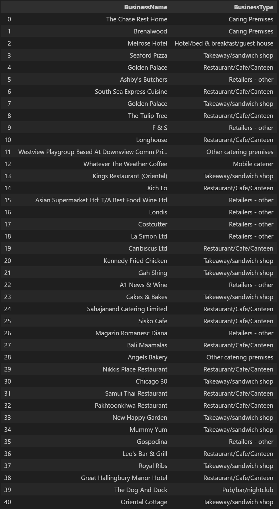
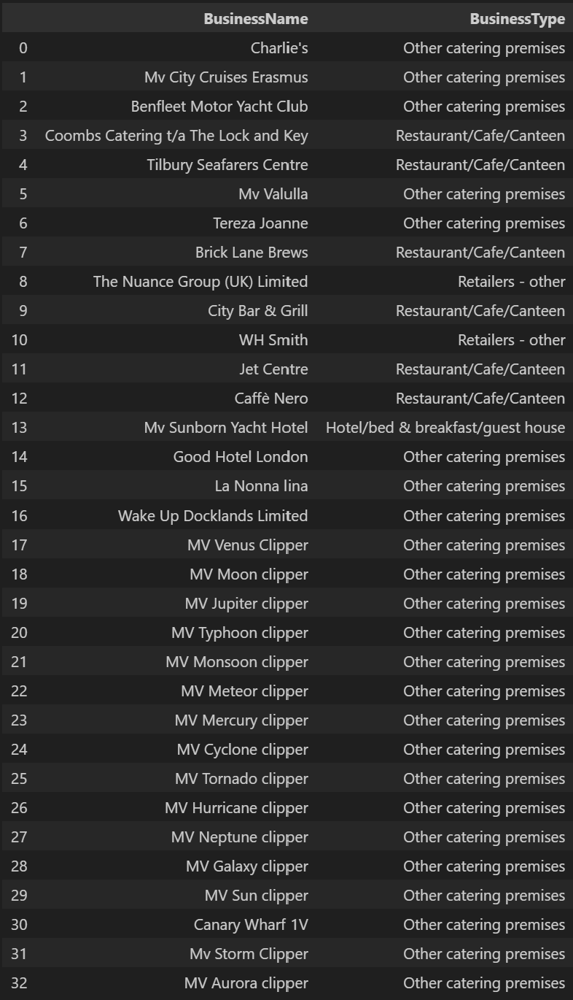
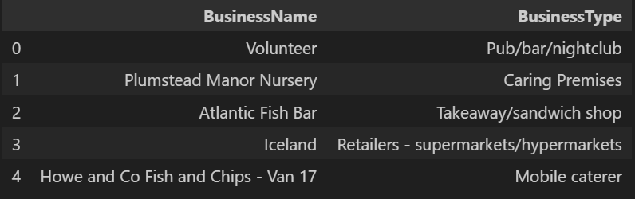
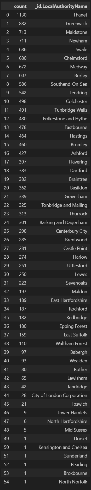

# nosql-challenge

## Overview
The UK Food Standards Agency evaluates various establishments across the United Kingdom, and gives them a food hygiene rating. The editors of a food magazine, "Eat Safe, Love", would like to evaluate some of the ratings data in order to help their journalists and food critics decide where to focus future articles.

## Repo Contents
1. Images folder - contains the output images for the analysis in Part 3 below.
2. Resources folder - contains the input file for the analysis, "establishments.json".
3. NoSQL_analysis.ipynb - jupyter notebook containing the code to complete the analysis detailed in Part 3 below.
4. NoSQL_setup.ipynb - jupyter notebook for Parts 1 and 2, containing code to set up and update the mongoDB called "uk_food" and a collection called "establishments" both of which will be leveraged for the analysis.
5. README.md

## Part 1: Database and Jupyter Notebook Set Up

1. Imported the data provided in the `establishments.json` file using the following Terminal command: `mongoimport --type json -d uk_food -c establishments --drop --jsonArray establishments.json'

## Part 2: Update the Database

At the direction of the magazine editors, the following changes were made to the `establishments` collection:

1. Added a new halal restaurant that opened in Greenwich, but hasn't been rated yet. 

2. The magazine is not interested in any establishments in Dover, so establishments within the Dover Local Authority were removed from the database.

3. Converted field types as needed.
   
## Part 3: Exploratory Analysis

*Eat Safe, Love* requested answers to the following questions, which will help them find the locations they wish to visit and avoid:

1. Which establishments have a hygiene score equal to 20?

2. Which establishments with London in the LocalAuthorityName have a RatingValue greater than or equal to 4?

3. What are the top 5 establishments with a `RatingValue` of 5, sorted by lowest hygiene score, nearest to the new restaurant added, "Penang Flavours"?

4. How many establishments in each Local Authority area have a hygiene score of 0? Sort the results from highest to lowest, and print out the top ten local authority areas.

